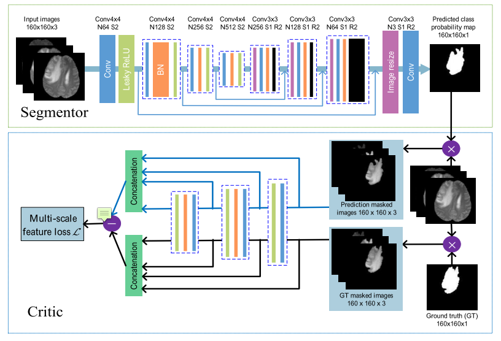

# DeepLearning SeGAN Segmentation
This contains an implementation of the SeGAN model for semantic segmentation introduced in https://arxiv.org/pdf/1706.01805.pdf

The model serves for semantic segmentation of image data and the authors have demonstrated its utility on cranial MRT images.

A summary of the model architecture from the paper is shown below

## Dependencies

* Python 3.6
* Numpy
* Keras 2.0
* Tensorflow >= 1.x
* TQDM (optional)

This work was inspired by [Xue et al.](http://arxiv.org/abs/1706.01805) as well as the excellent "Deep Learning for coders" tought by Jeremy Howard and Rachel Thomas in their [MOOC](http://course.fast.ai/)
